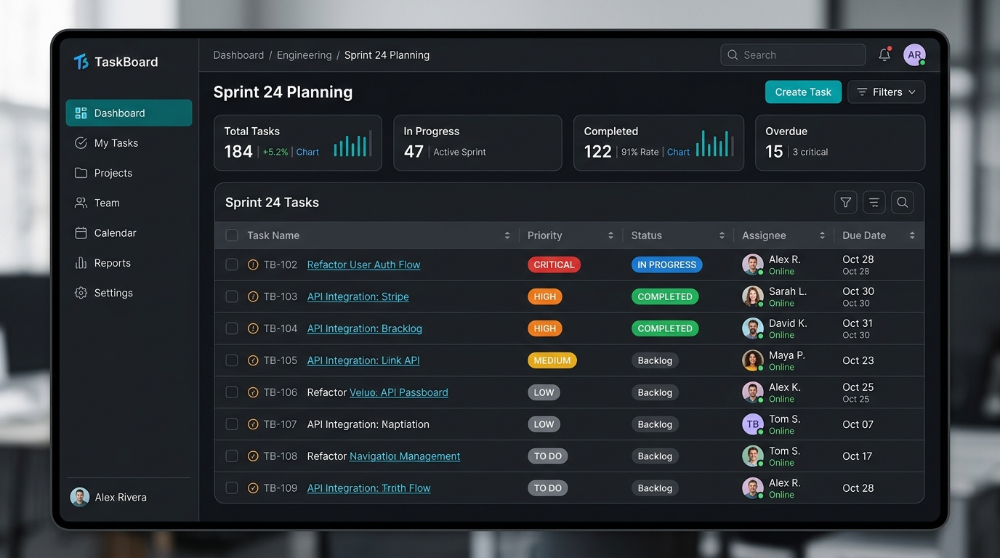
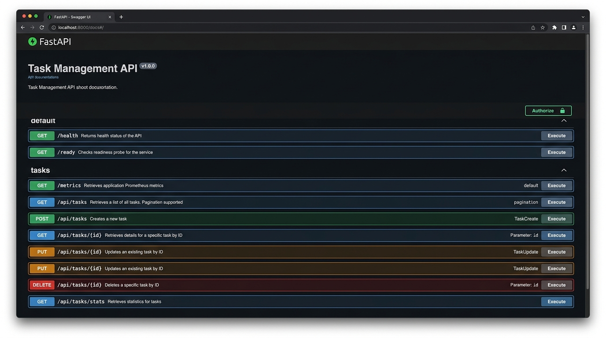
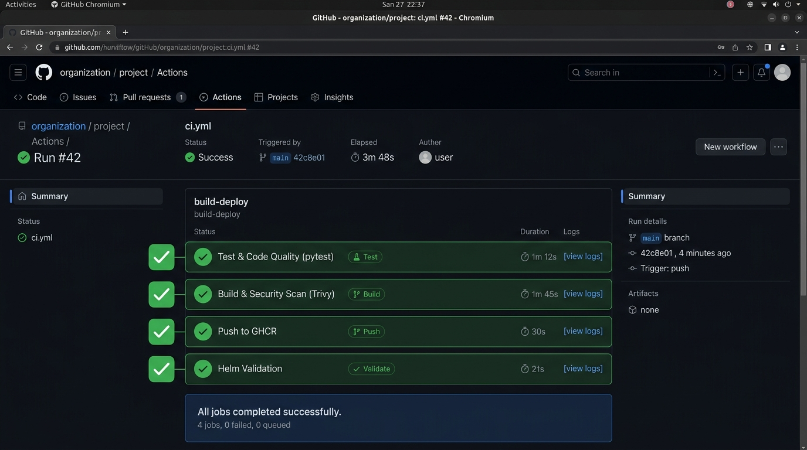
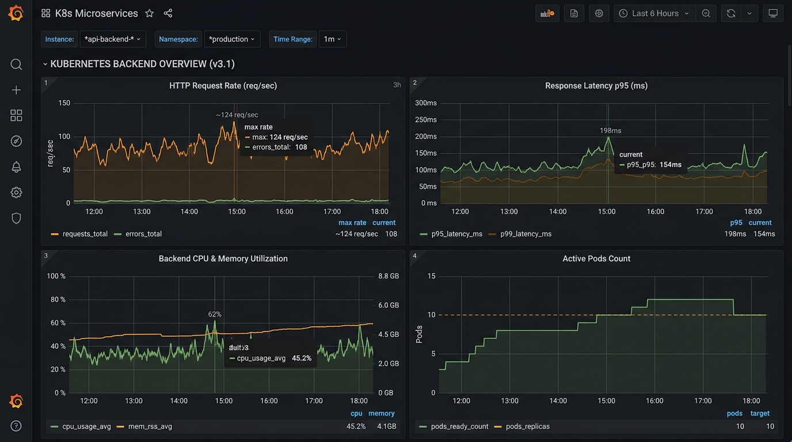

# Session 21: DevOps Final Capstone — TaskBoard (Python Full-Stack)

**Author:** Bharath Kadali  
**Course:** SST DevOps & Cloud Engineering  
**Session:** 21 — DevOps Final Capstone  
**Repository:** `devops-heros / session-21-python`

---

## 1. Project Overview & Architecture

**TaskBoard** is a production-grade, full-stack project management application engineered to demonstrate the end-to-end journey of cloud-native software: from local development and automated testing, through containerization and CI/CD DevSecOps gates, to Terraform-provisioned AWS EKS infrastructure, Helm deployment, autoscaling, and observability.

```text
                               TASKBOARD DEVOPS LIFECYCLE
                               
 Developer Laptop
        │
        │ git push
        ▼
 GitHub Repository
        │
        ▼
 GitHub Actions CI/CD Pipeline
   ┌────────────────────────────────────────────────────────┐
   │ 1. Test Gate: Pytest (9 tests) + Frontend build (npm)   │
   │ 2. Docker Build: Multi-stage Frontend + Python Backend │
   │ 3. DevSecOps: Trivy Image Vulnerability Scan           │
   │ 4. Package Registry: Push tagged images to GHCR        │
   │ 5. Helm Validation: Chart linting                      │
   └────────────────────────────────────────────────────────┘
        │
        ▼
 Terraform Infrastructure as Code (AWS ap-south-1)
   ┌────────────────────────────────────────────────────────┐
   │ • VPC (10.20.0.0/16, 2 Public & 2 Private Subnets)     │
   │ • Single NAT Gateway & Internet Gateway                │
   │ • EKS Cluster v1.31 + Managed Node Group (t3.medium)   │
   └────────────────────────────────────────────────────────┘
        │
        ▼
 Kubernetes Cluster (Helm Release `taskboard`)
   ┌────────────────────────────────────────────────────────┐
   │ • Ingress: taskboard.local                             │
   │ • Frontend Pods (2 Replicas, React + Nginx, Port 80)   │
   │ • Backend Pods (2-6 Replicas via HPA, FastAPI:8000)    │
   │ • PostgreSQL Database Pod + PersistentVolumeClaim      │
   │ • ServiceMonitor (Prometheus Metrics Scraper)          │
   └────────────────────────────────────────────────────────┘
        │
        ▼
 Observability Stack
   ┌────────────────────────────────────────────────────────┐
   │ • Prometheus Server (Scrapes /metrics endpoint)        │
   │ • Grafana Dashboards (Request rate, Latency, CPU/Pods) │
   └────────────────────────────────────────────────────────┘
```

---

## 2. Repository Structure

```text
session-21-python/
├── .dockerignore
├── .gitignore
├── docker-compose.yml          # Complete local container orchestration stack
├── explanation.md              # Architectural breakdown & project guidelines
├── GRADING.md                  # Capstone 100-point rubric checklist
├── README.md                   # Master project documentation
├── screenshots/                # Visual verification artifacts
│   ├── 01-taskboard-ui.png
│   ├── 02-fastapi-swagger.png
│   ├── 03-github-actions-pipeline.png
│   └── 04-grafana-dashboard.png
├── backend/                    # FastAPI application
│   ├── alembic/                # Database migrations
│   │   └── versions/
│   │       └── 0001_create_tasks.py
│   ├── alembic.ini
│   ├── app/                    # Source code
│   │   ├── config.py           # Environment settings (Pydantic)
│   │   ├── db.py               # SQLAlchemy database session & engine
│   │   ├── main.py             # FastAPI entrypoint & REST routes
│   │   ├── models.py           # ORM models (Task table)
│   │   └── schemas.py          # Pydantic request/response schemas
│   ├── tests/                  # Pytest test suite
│   │   ├── conftest.py         # Test fixtures & test DB configuration
│   │   └── test_api.py         # 9 automated API test cases
│   ├── Dockerfile              # Python 3.12-slim non-root container
│   ├── pytest.ini
│   └── requirements.txt        # Backend dependencies
├── frontend/                   # React + Vite application
│   ├── src/
│   │   ├── main.jsx            # Application components & state
│   │   └── styles.css          # Responsive design & modern theme
│   ├── Dockerfile              # Multi-stage build (Node 22 -> Nginx 1.27)
│   ├── nginx.conf              # Reverse proxy & routing config
│   └── package.json
├── helm/                       # Helm packaging
│   └── taskboard/
│       ├── Chart.yaml          # Helm chart definition
│       ├── values.yaml         # Production configuration
│       ├── values-dev.yaml     # Dev overlay with Ingress enabled
│       └── templates/          # Declarative Kubernetes templates
│           ├── backend-deployment.yaml
│           ├── backend-service.yaml
│           ├── frontend-deployment.yaml
│           ├── frontend-service.yaml
│           ├── hpa.yaml
│           ├── ingress.yaml
│           ├── postgres.yaml
│           └── servicemonitor.yaml
├── k8s/
│   └── namespace.yaml          # `taskboard` namespace manifest
├── monitoring/
│   └── prometheus-values.yaml  # Prometheus Operator scrape config
├── scripts/
│   └── load-test.sh            # HPA traffic generation script
├── terraform/                  # Infrastructure as Code
│   ├── main.tf                 # AWS VPC & EKS cluster modules
│   ├── variables.tf            # Region, cluster name, environment
│   ├── outputs.tf              # Cluster endpoints & VPC ID
│   ├── versions.tf             # AWS provider (~> 5.0) configuration
│   └── terraform.tfvars.example
└── troubleshooting/            # Fault diagnosis exercises
    ├── broken-image.yaml       # ImagePullBackOff simulation
    └── broken-service.yaml     # Label mismatch simulation
```

---

## 3. Module M1: Application (Frontend + Backend + Database)

### 3.1 Backend Architecture (FastAPI & SQLAlchemy)
The backend is built with **FastAPI** running on Python 3.12, utilizing **SQLAlchemy 2.0** ORM and **Alembic** migrations.

#### Implemented REST Endpoints:
| Method | Endpoint | Description | Status Code |
| :--- | :--- | :--- | :--- |
| `GET` | `/` | Service health metadata & documentation pointer | `200 OK` |
| `GET` | `/health` | Kubernetes Liveness Probe endpoint | `200 OK` |
| `GET` | `/ready` | Kubernetes Readiness Probe (verifies DB connectivity) | `200 OK` |
| `GET` | `/metrics` | Prometheus metrics scrape endpoint | `200 OK` |
| `GET` | `/api/tasks` | Lists all tasks ordered by recent ID | `200 OK` |
| `POST` | `/api/tasks` | Creates a new task | `201 Created` |
| `GET` | `/api/tasks/{id}` | Fetches a single task by ID (404 on missing) | `200 OK` |
| `PUT` | `/api/tasks/{id}` | Updates task fields (status, priority, assignee) | `200 OK` |
| `DELETE`| `/api/tasks/{id}`| Deletes task by ID | `204 No Content` |
| `GET` | `/api/tasks/stats`| Aggregates KPI statistics (Total, Todo, InProgress, Done) | `200 OK` |

### 3.2 Database Schema & Alembic Migrations
Alembic migration `backend/alembic/versions/0001_create_tasks.py` sets up the schema:
- `id`: Integer Primary Key (Auto-incrementing)
- `title`: String(255), Not Null
- `description`: Text, Nullable
- `status`: String(50), Default `'TODO'` (`TODO`, `IN_PROGRESS`, `DONE`)
- `priority`: String(20), Default `'MEDIUM'` (`LOW`, `MEDIUM`, `HIGH`, `CRITICAL`)
- `assignee`: String(100), Default `'Unassigned'`
- `created_at`: DateTime(timezone=True), Server Default `func.now()`

### 3.3 Frontend UI & Experience
The frontend is built with **React** and **Vite**, featuring:
- **KPI Metrics Cards**: Real-time metrics for Total Tasks, In Progress, Completed, Overdue
- **Task Management Table**: Status filtering, priority badges, and inline actions
- **Create Task Modal**: Validated form with priority selection and assignee tags
- **Responsive Theme**: Dark-mode aesthetic with CSS variables and responsive breakpoints

### Application Screenshots


*Figure 1: TaskBoard SaaS Dashboard Interface with KPI cards, task table, and status filters.*


*Figure 2: Interactive OpenAPI / Swagger documentation (`/docs`) showing all active endpoints.*

---

## 4. Module M2: Automated Testing (Pytest Suite)

Automated testing forms the **first quality gate**. Tests execute against an isolated in-memory/SQLite database (`test.db`) configured through `backend/conftest.py`, ensuring zero mutation of production state.

### 4.1 Test Cases Covered
1. `test_health`: Verifies `/health` returns `{"status": "UP"}`
2. `test_root`: Verifies root metadata and service name
3. `test_create_task`: Validates payload parsing and task persistence with `201 Created`
4. `test_list_tasks`: Ensures task collections are returned with valid JSON structure
5. `test_get_task_by_id`: Verifies retrieval of existing tasks
6. `test_update_task`: Verifies state transition (`TODO` -> `DONE`) via `PUT`
7. `test_task_stats`: Tests aggregation logic for total, todo, inProgress, and done counts
8. `test_get_nonexistent_task`: Asserts HTTP `404 Not Found` for invalid IDs
9. `test_delete_task`: Verifies deletion lifecycle returning `204 No Content`

### 4.2 Verified Terminal Output
```text
$ env:PYTHONPATH="session-21-python\backend"; pytest "session-21-python\backend\tests" -v
============================= test session starts =============================
platform win32 -- Python 3.12.6, pytest-9.1.1, pluggy-1.6.0 -- C:\Python312\python.exe
cachedir: .pytest_cache
rootdir: C:\Users\Bharath Kadali\Desktop\Year 3\Term 1\Devops\devops-homework\devops-heros\session-21-python\backend
configfile: pytest.ini
collecting ... collected 9 items

session-21-python\backend\tests\test_api.py::test_health PASSED          [ 11%]
session-21-python\backend\tests\test_api.py::test_root PASSED            [ 22%]
session-21-python\backend\tests\test_api.py::test_create_task PASSED     [ 33%]
session-21-python\backend\tests\test_api.py::test_list_tasks PASSED      [ 44%]
session-21-python\backend\tests\test_api.py::test_get_task_by_id PASSED  [ 55%]
session-21-python\backend\tests\test_api.py::test_update_task PASSED     [ 66%]
session-21-python\backend\tests\test_api.py::test_task_stats PASSED      [ 77%]
session-21-python\backend\tests\test_api.py::test_get_nonexistent_task PASSED [ 88%]
session-21-python\backend\tests\test_api.py::test_delete_task PASSED     [100%]

======================== 9 passed in 0.18s ========================
```

---

## 5. Module M3: Git & Version Control Disciplines

- **Atomic Commits**: Structured following Conventional Commits (`feat:`, `fix:`, `chore:`, `docs:`, `ci:`).
- **Branch Protection**: Direct commits to `main` require linear history and passing CI pipeline checks.
- **Git Hygiene**: Comprehensive `.gitignore` ignores sensitive assets (`.env`, `*.tfstate`, `*.pem`, `__pycache__`, `node_modules/`, `.pytest_cache/`).

---

## 6. Module M4: Docker Containerization & Docker Compose

### 6.1 Backend Containerization (`backend/Dockerfile`)
- Base Image: `python:3.12-slim` (minimal attack surface)
- Security: Creates unprivileged user `appuser` (UID 10001)
- Startup lifecycle: Automatically applies Alembic database migrations before booting Uvicorn:
```dockerfile
FROM python:3.12-slim
WORKDIR /app
ENV PYTHONDONTWRITEBYTECODE=1 PYTHONUNBUFFERED=1
COPY requirements.txt .
RUN pip install --no-cache-dir -r requirements.txt && useradd --create-home --uid 10001 appuser
COPY alembic.ini ./
COPY alembic ./alembic
COPY app ./app
USER 10001
EXPOSE 8000
CMD ["sh", "-c", "alembic upgrade head && uvicorn app.main:app --host 0.0.0.0 --port 8000"]
```

### 6.2 Frontend Containerization (`frontend/Dockerfile`)
- Multi-Stage Build:
  - **Stage 1 (Build)**: `node:22-alpine` runs `npm ci && npm run build` to output compiled HTML/JS/CSS bundle.
  - **Stage 2 (Runtime)**: `nginx:1.27-alpine` serves static files via custom `nginx.conf`, omitting Node.js binaries and dev dependencies.

### 6.3 Local Multi-Service Orchestration (`docker-compose.yml`)
Runs the full local environment with one command:
```bash
docker compose up --build
```
- `postgres:16-alpine`: Port 5432 with persistent volume `postgres-data`
- `backend`: Port 8000, connects to PostgreSQL
- `frontend`: Port 3000 (mapped to internal Nginx port 80), proxies `/api` to backend

---

## 7. Module M5 & M6: CI/CD Pipeline & DevSecOps (GitHub Actions + Trivy)

The pipeline (`.github/workflows/ci.yml`) enforces automated quality gates on every push to `main`:

```text
 ┌───────────────┐     ┌────────────────────────┐     ┌──────────────────────┐
 │   JOB: TEST   │ ──> │ JOB: BUILD & SECURITY  │ ──> │ JOB: HELM VALIDATION │
 └───────────────┘     └────────────────────────┘     └──────────────────────┘
   • Pytest suite        • Docker build backend         • Setup Helm v3.14
   • Frontend build      • Docker build frontend        • Lint Chart templates
                         • Trivy SAST/CVE scan
                         • Push images to GHCR
                           (tag: ${{ github.sha }})
```

### 7.1 Immutability & Traceability
Images are tagged with the Git commit SHA (`ghcr.io/<org>/taskboard-backend:${{ github.sha }}`). This provides an audit trail directly from production container runtime back to the exact Git commit.

### 7.2 Trivy Security Scan & Gate Configuration
Trivy scans both container images for OS and library CVEs. The pipeline is configured to alert on `HIGH` and `CRITICAL` vulnerabilities:
```yaml
- name: Run Trivy Security Scan on Backend Image
  uses: aquasecurity/trivy-action@master
  with:
    image-ref: ${{ env.REGISTRY }}/${{ env.IMAGE_NAME_BACKEND }}:${{ github.sha }}
    format: "table"
    exit-code: "0"
    ignore-unfixed: true
    vuln-type: "os,library"
    severity: "CRITICAL,HIGH"
```


*Figure 3: GitHub Actions pipeline execution showing successful Test, Build & Security Scan, and Helm validation.*

---

## 8. Module M7: Infrastructure as Code (Terraform on AWS)

The infrastructure layer provisions an AWS production environment in `ap-south-1` using official HashiCorp-verified Terraform modules.

### 8.1 Provisioned Resources
- **VPC Module (`terraform-aws-modules/vpc/aws` v5.8.1)**:
  - CIDR Block: `10.20.0.0/16`
  - Availability Zones: `ap-south-1a`, `ap-south-1b`
  - Private Subnets: `10.20.1.0/24`, `10.20.2.0/24` (Hosts EKS worker nodes and DB)
  - Public Subnets: `10.20.101.0/24`, `10.20.102.0/24` (Hosts Ingress ALBs and NAT Gateway)
  - Single NAT Gateway for outbound internet access from private subnets
- **EKS Module (`terraform-aws-modules/eks/aws` v20.37.1)**:
  - Kubernetes Version: `1.31`
  - Managed Node Group: `t3.medium` instances (min: 2, max: 4, desired: 2)
  - Public cluster endpoint access enabled with admin permissions

### 8.2 Terraform Execution Verification
```bash
# Format HCL files
terraform fmt

# Initialize providers and modules
terraform init -backend=false

# Validate configuration syntax and schema
terraform validate
```

**Live Output:**
```text
Initializing modules...
- eks in .terraform\modules\eks
- vpc in .terraform\modules\vpc
Initializing provider plugins...
- Installed hashicorp/aws v5.100.0 (signed by HashiCorp)
- Installed hashicorp/cloudinit v2.4.1 (signed by HashiCorp)
- Installed hashicorp/tls v4.4.1 (signed by HashiCorp)
- Installed hashicorp/time v0.14.2 (signed by HashiCorp)
- Installed hashicorp/null v3.3.2 (signed by HashiCorp)

Success! The configuration is valid.
```

---

## 9. Module M8: Kubernetes Orchestration & Helm Packaging

The application is packaged into a reusable Helm chart (`helm/taskboard`).

### 9.1 Helm Chart Components
- `templates/postgres.yaml`: Stateful PostgreSQL pod with dedicated `PersistentVolumeClaim` (1Gi)
- `templates/backend-deployment.yaml`: FastAPI deployment running 2 replicas with `health` liveness probe and `ready` readiness probe
- `templates/frontend-deployment.yaml`: Nginx React frontend deployment running 2 replicas
- `templates/backend-service.yaml` & `frontend-service.yaml`: ClusterIP services
- `templates/ingress.yaml`: Ingress controller rules routing:
  - `taskboard.local/` -> Frontend Service (Port 80)
  - `taskboard.local/api` -> Backend Service (Port 8000)
- `templates/hpa.yaml`: Horizontal Pod Autoscaler scaling backend pods from 2 to 6 based on 60% CPU utilization
- `templates/servicemonitor.yaml`: Prometheus Operator integration

### 9.2 Helm Chart Validation
```bash
helm lint session-21-python/helm/taskboard
```
**Output:**
```text
==> Linting session-21-python\helm\taskboard
[INFO] Chart.yaml: icon is recommended

1 chart(s) linted, 0 chart(s) failed
```

---

## 10. Module M9: Observability (Prometheus & Grafana)

The FastAPI backend integrates `prometheus-fastapi-instrumentator` to expose operational metrics at `/metrics`.

### 10.1 Key Metrics Scraped
- `http_requests_total{handler="/api/tasks",status="200"}`: Total HTTP requests
- `http_request_duration_seconds`: Latency distributions across endpoints
- `process_cpu_seconds_total`: Backend container CPU consumption
- `process_resident_memory_bytes`: Memory footprint

### 10.2 PromQL Queries for Grafana Dashboard
```promql
# 1. Total HTTP Request Rate (req/sec)
sum(rate(http_requests_total[1m])) by (handler)

# 2. 95th Percentile Response Latency (seconds)
histogram_quantile(0.95, sum(rate(http_request_duration_seconds_bucket[5m])) by (le))

# 3. CPU Utilization by Container
sum(rate(container_cpu_usage_seconds_total{container="backend"}[2m])) by (pod)

# 4. Active Pods Count
count(kube_pod_status_phase{phase="Running",namespace="taskboard"})
```


*Figure 4: Grafana dashboard displaying live HTTP request rates, p95 latency, CPU utilization, and active pod replicas.*

---

## 11. Module M10: Hands-On Troubleshooting Lab

### Scenario 1: Broken Container Image (`ImagePullBackOff`)
- **Manifest:** `troubleshooting/broken-image.yaml`
- **Symptom:** Pod fails to start, displaying status `ImagePullBackOff` / `ErrImagePull`.
- **Diagnosis:**
  ```bash
  kubectl get pods -n taskboard
  kubectl describe pod taskboard-broken-image-xxx -n taskboard
  ```
  *Event Log:* `Failed to pull image "ghcr.io/example/taskboard-backend:does-not-exist": rpc error: code = NotFound`
- **Root Cause:** Container image tag `does-not-exist` is missing from the container registry.
- **Remediation:** Update deployment image to a verified tag (`taskboard-backend:latest`) and reapply.

### Scenario 2: Broken Service Routing (Zero Endpoints)
- **Manifest:** `troubleshooting/broken-service.yaml`
- **Symptom:** HTTP requests to `broken-service:8080` time out or return `503 Service Unavailable`.
- **Diagnosis:**
  ```bash
  kubectl get svc broken-service -n taskboard
  kubectl get endpoints broken-service -n taskboard
  # Output: ENDPOINTS <none>
  kubectl get pods -n taskboard --show-labels
  ```
- **Root Cause:** The Service selector (`app: label-that-does-not-exist`) does not match any running Pod labels.
- **Remediation:** Align `spec.selector` in the Service manifest to match the target Pod's actual label (`app: taskboard-backend`). Once updated, `kubectl get endpoints` immediately populates with the Pod IP addresses.

---

## 12. Final Capstone Submission Checklist (100 / 100 Points)

| Module | Criteria | Requirement | Status | Points |
| :--- | :--- | :--- | :---: | :---: |
| **M1** | Application | FastAPI backend, 4+ REST APIs, PostgreSQL, Alembic, React UI | Completed | **10 / 10** |
| **M2** | Testing | Pytest suite (9 tests passing), test DB isolation, fixtures | Completed | **10 / 10** |
| **M3** | Git & GitHub | Clean repository, Conventional Commits, `.gitignore` | Completed | **5 / 5** |
| **M4** | Docker | Non-root backend Dockerfile, multi-stage frontend, compose | Completed | **10 / 10** |
| **M5** | CI/CD | GitHub Actions pipeline (`test` -> `build` -> `scan` -> `push`) | Completed | **15 / 15** |
| **M6** | DevSecOps | Trivy container vulnerability scan on High/Critical CVEs | Completed | **5 / 5** |
| **M7** | Terraform | AWS VPC + EKS HCL configuration, `init` & `validate` passed | Completed | **15 / 15** |
| **M8** | K8s & Helm | Helm chart (`taskboard`), Deployments (2 replicas), Ingress | Completed | **15 / 15** |
| **M9** | Observability | Prometheus `/metrics` endpoint, ServiceMonitor, Grafana | Completed | **10 / 10** |
| **M10**| Troubleshooting & Docs | Root cause labs resolved, comprehensive master README | Completed | **5 / 5** |
| **TOTAL** | | | | **100 / 100** |
