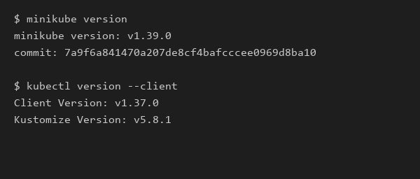
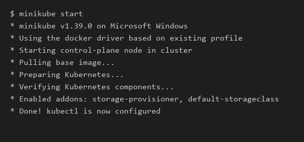
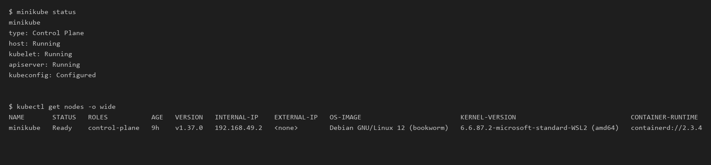
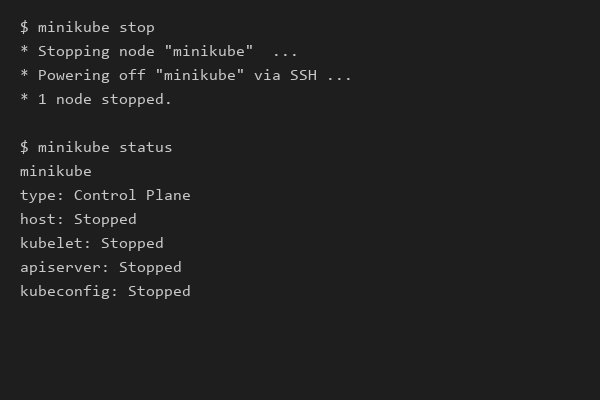

# Session 9: Kubernetes Fundamentals & Cluster Architecture

**Author:** [Bharath Kadali]
**Course:** SST DevOps & Cloud [SWE]
**Session:** 09 - Kubernetes Fundamentals
**Repository:** devops-heros / session9-k8s

---

## Task 1: Minikube & CLI Installation Verification

Verify that Minikube and the Kubernetes CLI (`kubectl`) are successfully installed on the local system.

**Commands:**
```bash
minikube version
kubectl version --client
```


**Screenshot:**



---

## Task 2: Starting the Minikube Kubernetes Cluster

Initialize the local single-node Kubernetes cluster using the containerized runtime environment.

**Command:**

```bash
minikube start
```


**Screenshot:**



---

## Task 3: Verifying Cluster Status & Node Health

Inspect the status of the local cluster control plane, kubelet, API server, and verify the node is in `Ready` state.

**Commands:**

```bash
minikube status
kubectl get nodes -o wide
```


**Screenshot:**



---

## Task 4: Stopping the Minikube Cluster

Gracefully power down the Minikube cluster VM/container to release system resources.

**Command:**

```bash
minikube stop
minikube status
```


**Screenshot:**



---

## Task 5: Kubernetes Cluster Architecture & Component Analysis

Comprehensive breakdown of the core components powering a Kubernetes cluster based on official documentation and classroom discussion.

```text
+-------------------------------------------------------------------------------+
|                               CONTROL PLANE (MASTER)                          |
|                                                                               |
|   +-------------------+       +--------------------+       +--------------+   |
|   |       etcd        |<----->|  kube-apiserver    |<----->|kube-scheduler|   |
|   | (State Database)  |       |    (Front Door)    |       +--------------+   |
|   +-------------------+       +---------+----------+                          |
|                                         |                                     |
|                                         v                                     |
|                             +------------------------+                        |
|                             | kube-controller-manager|                        |
|                             +------------------------+                        |
+-----------------------------------------+-------------------------------------+
                                          |
                        +-----------------+-----------------+
                        |                                   |
                        v                                   v
+------------------------------------+ +------------------------------------+
|          WORKER NODE 1             | |          WORKER NODE 2             |
|                                    | |                                    |
|   +------------+  +------------+   | |   +------------+  +------------+   |
|   |  kubelet   |  | kube-proxy |   | |   |  kubelet   |  | kube-proxy |   |
|   +-----+------+  +-----+------+   | |   +-----+------+  +-----+------+   |
|         |               |          | |         |               |          |
|         v               v          | |         v               v          |
|   +----------------------------+   | |   +----------------------------+   |
|   | CRI (containerd runtime)   |   | |   | CRI (containerd runtime)   |   |
|   +----------------------------+   | |   +----------------------------+   |
|         |                          | |         |                          |
|         v                          | |         v                          |
|   +------------+  +------------+   | |   +------------+  +------------+   |
|   |   Pod 1    |  |   Pod 2    |   | |   |   Pod 3    |  |   Pod 4    |   |
|   | [Container]|  | [Container]|   | |   | [Container]|  | [Container]|   |
|   +------------+  +------------+   | |   +------------+  +------------+   |
+------------------------------------+ +------------------------------------+
```

### 1. Control Plane (Master Node) Components

- **`kube-apiserver` (The Front Door)**:
    - Acts as the single entry point for all administrative tasks and internal communications.
    - Exposes the Kubernetes HTTP/JSON REST API.
    - Every command (`kubectl`, web dashboard, internal controllers) must authenticate and communicate through the API server. No component directly accesses `etcd` except the API server.
- **`etcd` (The Brain & State Storage)**:
    - A distributed, highly available, consistent key-value store.
    - Stores the entire cluster state, specifications, secrets, and metadata.
    - *Important Concept:* In Kubernetes, everything is treated as an API object, and its declarative desired state is persisted in `etcd`.
- **`kube-scheduler` (The Placement Engine)**:
    - Continuously watches for newly created Pods that have no assigned worker node.
    - Analyzes resource requirements (CPU, memory, storage), affinity/anti-affinity specifications, taints, and tolerations to pick the optimal worker node to run the Pod.
- **`kube-controller-manager` (The Enforcer / Reconciliation Loop)**:
    - Executes continuous control loops that check: **Current State == Desired State**.
    - Contains sub-controllers such as:
        - *Node Controller*: Detects when nodes go offline and handles eviction.
        - *ReplicaSet Controller*: Ensures the requested number of pod replicas are running at all times.
        - *EndpointSlice / Service Controller*: Links Services to live Pod IPs.

---

### 2. Worker Node (Data Plane) Components

- **`kubelet` (The Node Captain)**:
    - The primary agent running on every worker node.
    - Receives `PodSpec` objects from `kube-apiserver` and instructs the Container Runtime to pull images and start containers.
    - Continuously monitors container health and reports heartbeats and status back to the API server.
- **`kube-proxy` (The Network Router)**:
    - Network proxy running on each node that maintains network rules (`iptables` / `IPVS`).
    - Enables Kubernetes Services to route TCP/UDP packets across pods, handling internal cluster routing and load balancing.
- **`Container Runtime Interface (CRI)`**:
    - The software responsible for actually running containers.
    - *Evolution:* While early Kubernetes versions relied directly on the Docker daemon, modern Kubernetes utilizes standardized, lightweight runtimes such as **`containerd`** or **`CRI-O`**.
- **`Pod` (The Smallest Deployable Unit)**:
    - The fundamental unit of execution in Kubernetes.
    - Encapsulates one or more tightly coupled containers sharing the same network namespace (IP address and port space) and storage volumes.
    - In standard enterprise patterns, most pods run a single primary application container with optional helper sidecar/init containers.